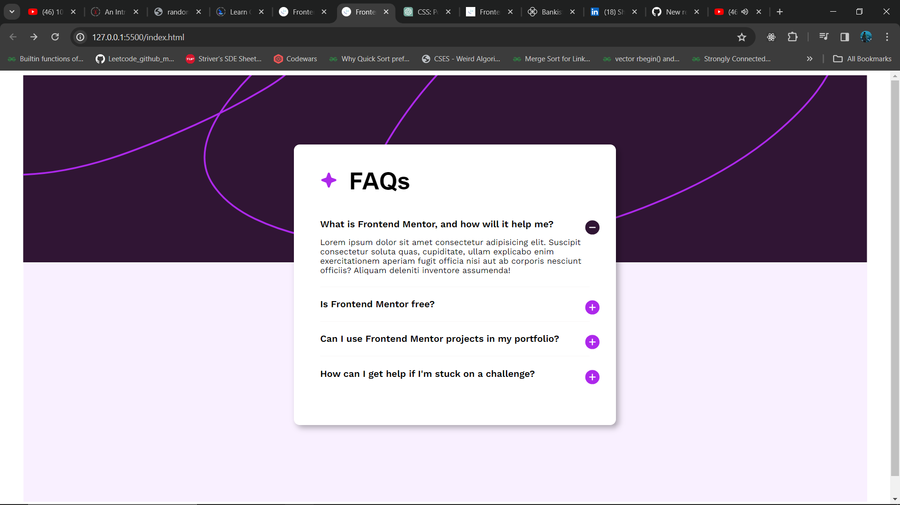

# Frontend Mentor - FAQ accordion solution

This is a solution to the [FAQ accordion challenge on Frontend Mentor](https://www.frontendmentor.io/challenges/faq-accordion-wyfFdeBwBz). It is a fully responsive project.

## Table of contents

- [Overview](#overview)
  - [The challenge](#the-challenge)
  - [Screenshot](#screenshot)
  - [Links](#links)
- [My process](#my-process)
  - [Built with](#built-with)
  - [What I learned](#what-i-learned)
  - [Useful resources](#useful-resources)
- [Author](#author)

## Overview

### The challenge

Users should be able to:

- Hide/Show the answer to a question when the question is clicked
- Navigate the questions and hide/show answers using keyboard navigation alone
- View the optimal layout for the interface depending on their device's screen size
- See hover and focus states for all interactive elements on the page

### Screenshot

### Links

- [Live Site URL](https://shubham-kpl.github.io/faq-accordion-main/)

## My process

### Built with

- Semantic HTML5 markup
- CSS custom properties
- Flexbox
- CSS Grid
- Media Query

### What I learned

For a long time, I used toget bothered by the "position" properties in CSS. This project used them a lot of times and it helped me becoming familier with all of them. I got to understand many other CSS properties while completing this project.

### Useful resources

- [ChatGPT](https://chat.openai.com/) - I asked it wherever I was not able to understand something.

## Author

- LinkedIn - [Shubham Kandpal](https://www.linkedin.com/in/shubham-kandpal-59870322a)
- Frontend Mentor - [@Shubham-kpl](https://www.frontendmentor.io/profile/Shubham-kpl)
- Twitter - [@Shubham27200503](https://www.twitter.com/Shubham27200503)
